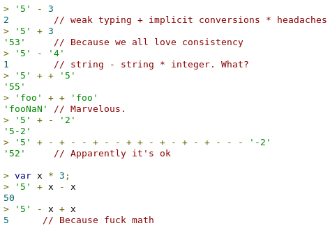

### Языки программирования

Есть анлийский язык. На нём общаются люди. А ещё – на немецком, филиппинском, испанском, греческом и прорве других.

А есть Питон (голос зануды про правильное название). Это язык, на котором человек общается с компьютером.
С компьютером можно общаться на куче языков:
Си, Паскаль, Хаскель, Го, Свифт, Руби, ПХП, Бейсик, Эрланг, Эр и много других.

### Особенности Питона

Мы тут будем учить именно Питон. Начнём с короткого обзора того, чем он отличается от остальных языков.
Делать ничего не надо: прочитал, запомнил пару пунктов и всё, можно хвастаться всем, что ты в теме (не надо так).

### Лаконичность

У Питона такое сообщество, что оно не приветствует разброда в использовании языка. Стандарт написания кода – это часть
языка. Философия написания кода – тоже часть языка. Поэтому два хороших программиста напишут очень похожий код:
 не надо тратить время на "блин, а что он тут имел в виду?...".

У Питона такой синтаксис, что он помогает писать код очень коротко.
Нет лишних скобок, длинных ключевых слов, сложных трюков и всякого такого.
Описать логику, перевести на английский, разбавить отступами и синтаксисом – всё, программа готова.

У Питона такая стандартная библиотека, что она помогает выполнять кучу рутинных операций.
Она поможет отправить емейл, закодировать строку, поднять веб-сервер, узнать время, удалить файл, посчитать дисперсию,
заархивировать файл, вытащить данные из базы данных и ещё прорву всего всего парой строк.

У Питона такое количество сторонних модулей, что можно сэкономить тысячи человеко-часов работы. Нужно написать сайт?
Научить нейронную сеть разгадывать капчу? Скачать аудио из "Вконтакте"? Узнавать людей на фотографиях?
Смоделировать полёт ракеты? Написать бота? Для всего этого есть готовые модули, их надо только установить и воспользоваться.

Всё это делает процесс написания кода очень быстрым. 

### Крутая документация

Попробуйте загуглить [python function], [python parse json] или, например [python create process].
В первых результатах будет ссылка на https://docs.python.org – сайт официальной документации.

Это потому что документация очень подробная: в ней есть материалы для новичков, доки к каждому модулю, рекомендации
по использованию, подводные камни и дальнейшее чтение. И это всё – для каждой версии языка.
Такой удобной и подробной документации нет ни у кого.

А ещё есть http://stackoverflow.com/ – сайт, на котором одни программисты отвечают
другим программистам на вопросы о программировании. За время его существования там были заданы все возможные вопросы.
Серьёзно: любой вопрос в духе "как это сделать на Питоне" или "почему этот код не работает"
уже был задан, просмотрен и отвечен.
 
Всё это делает процесс изучения и написания кода быстрым: вся нужная информация находится на расстоянии одного
удачного поискового запроса.

[q Какого из этих вопросов нет в официальных FAQ официальной документации?]

*o Why am I getting strange results with simple arithmetic operations?
*o Why is Python installed on my machine?
*o [ok] How can I implement base abstract factory class in Python?
*o Writing C is hard; are there any alternatives?

### Строгая динамическая типизация

_Динамическая типизация_ – значит, в одной и той же переменной в разное время могут храниться значения
разных типов. Сейчас – число, потом – строка, и всё – в одной переменной.

Во многих языках так нельзя: создал, мол, целочисленную переменную, вот и храни в ней целые числа.
Это удобно для компьютера, но не всегда удобно для программиста.

_Строгая типизация_ – значит, нельзя просто так производить действия с объектами разных типов. Например, строку с
числом сложить не получится: сначала надо превратить строку в число, а только потом – сложить. Сам Питон
такое преобразование делать не будет.

Может показаться, что это неудобно, но на самом деле это защищает от прорвы ошибок. Чтобы понять о чём 
речь, достаточно посмотреть на Яваскрипт, язык со слабой типизацией:

### Автоматическое управление памятью

Управление памятью – это когда для каждой кучки данных в программе нужно руками выделить место в оперативной памяти.
Следить, чтобы данные не вышли за пределы этого места. Не забыть освободить это место после того, как данные не нужны.
В общем, адский геморрой.

В Питоне об этом думать не надо: язык программирования всё сделает за программиста. Правда, сделает неидеально:
о том, как Питон работает с памятью, надо знать.

### И ещё много всякого

Помимо перечисленного, Питон знаменит много чем ещё: отступами, интроспекцией,
дзеном, портируемостью, GIL-ом, названием.

